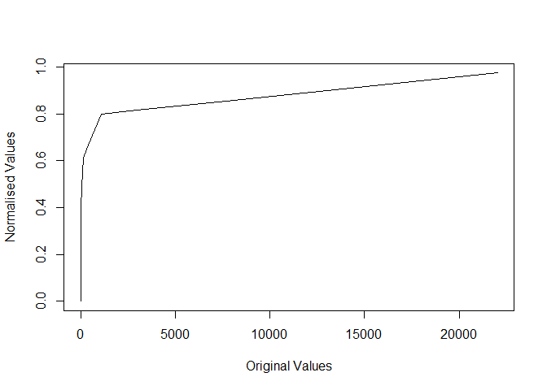

<!-- README.md is generated from README.Rmd. Please edit that file -->

# piecenorm

<!-- badges: start -->
<!-- badges: end -->

The goal of piecenorms is to provide implementation of piecewise
normalisation techniques useful when dealing with the communication of
skewed and highly skewed data.

## Installation

You can install the development version of piecenorm from
[GitHub](https://github.com/) with:

``` r
install.packages('piecenorms')
# install.packages("devtools")
devtools::install_github("david-hammond/piecenorm")
```

## Example

This is a basic example which shows you how to solve a common
normalisation problem. There are many mathematical transformations that
can be made on skewed data. However, these can be a barrier when
communicating to a non-technical audience. `piecenorms` allows the use
to:

1.  Provide a set of observations `obs`

2.  Select a set of class breaks, either through using the `classInt`
    (or other similar) packages, or by selecting the manually based on
    expert judgement and ease of communication purposes.

3.  Calculate a normalisation of between 0 and 1 for the values within
    the observations based on the class intervals.

Example R Code can be found below.

``` r
library(piecenorms)
x <- round(exp(1:10),2)
brks <- c(min(x), 8, 20, 100, 1000, 25000)
y <- piecenorm(x, brks)
#> Note: Maximum of the breaks is greater than the maximum of the observations.
#> Proceeding with calculation, normalised values will have a maximum < 1
```

``` r
plot(x, y, type = 'l',
     xlab = "Original Values",
     ylab = "Normalised Values")
```



For any call to `piecenorm`, the user provides a vector of observations,
a vector of breaks and a direction for the normalisation. The data is
then cut into classes and normalised within its class.

**Number of Bins:**

$$\begin{equation}{ n = \text{length}(\text{brks}) - 1}\end{equation}$$

**Normalisation Class Intervals:**

$$\begin{equation}{\left(\frac{i-1}{n}, \frac{i}{n}\right] \forall i \in \{1:n\}}\end{equation}$$

In cases where there is only one bin defined as `c(min(obs), max(obs))`,
the function `piecenorm` resolves to standard minmax normalisation.

## Notes

As with any non-linear transformation, **piecewise normalization**
preserves **ordinal invariance** within each class but does not preserve
**global relative magnitudes**. However, it does maintain **relative
magnitudes within each class**. On the other hand, more standard
techniques like **min-max normalization** preserves both **ordinal
invariance** and **global relative magnitudes**.

Definitions of each are as follows:

- **Ordinal Invariance**: The property that the order of the data points
  is preserved. If one normalized value is larger than another, it
  reflects the same order as in the original data.

- **Non-Preservation of Relative Magnitudes (Global)**: This refers to
  the loss of the proportionality of the original data values when
  normalized. If one value is twice as large as another in the original
  data, this relationship might not be preserved in the normalized data.

- **Within-Class Relative Magnitude Preservation**: This indicates that
  within each class or subset of data, the relative magnitudes of the
  data points are maintained. If data points are normalized within
  classes, their relative sizes in relation to each other remain the
  same as in the original data.
